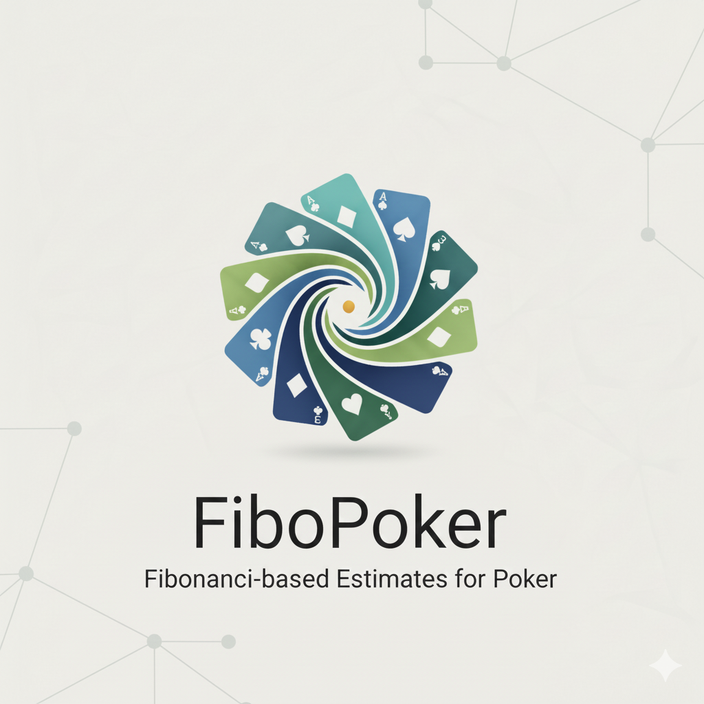

# FiboPoker

<div align="center">
  
</div>

リアルタイム協調型フィボナッチポーカーアプリケーション

## 🚀 デモ

**https://fibopoker.pages.dev/**

## 概要

FiboPokerは、アジャイル開発のプランニングポーカーをオンラインで実施できるWebアプリケーションです。
複数のメンバーが同時にカードを選択し、リアルタイムで結果を共有できます。

### 主な機能

- 🎴 **フィボナッチカード選択**: 1, 2, 3, 5, 8, 13, 21のカードから選択
- 👥 **リアルタイム同期**: 参加者の選択状態をリアルタイムで表示
- 📊 **統計表示**: 最大値、最小値、中央値、平均値を自動計算
- 🔄 **自動集計**: 全員が選択完了で自動的に結果を表示
- 🔗 **簡単参加**: URLを共有するだけで参加可能
- 📱 **レスポンシブ対応**: PC・タブレット・スマートフォンで利用可能
- 🔌 **再接続対応**: ネットワーク切断時の自動再接続機能

## 技術スタック

- **Frontend**: React 19 + TypeScript + Vite
- **Backend**: Supabase (PostgreSQL + Realtime)
- **Styling**: CSS Modules
- **Deployment**: Cloudflare Pages
- **Authentication**: Supabase Anonymous Auth

## アーキテクチャ

### システム構成図

```
┌─────────────┐
│   Browser   │ ← ユーザー
└──────┬──────┘
       │ HTTPS
       ↓
┌─────────────────────┐
│  Cloudflare Pages   │ ← Static Hosting + CDN
│  (React SPA)        │
└──────┬──────────────┘
       │ WebSocket + REST API
       ↓
┌─────────────────────┐
│     Supabase        │ ← Backend as a Service
├─────────────────────┤
│ • PostgreSQL        │ ← データ永続化
│ • Realtime          │ ← WebSocket通信
│ • Anonymous Auth    │ ← 匿名認証
│ • Row Level Security│ ← アクセス制御
└─────────────────────┘
```

### データベース設計

```sql
rooms (ルーム)
├─ id: uuid (PK)
├─ code: varchar(8) (Unique) -- 8文字ランダム英数字
├─ created_at: timestamptz
└─ updated_at: timestamptz

participants (参加者)
├─ id: uuid (PK)
├─ room_id: uuid (FK → rooms)
├─ session_id: uuid -- Supabase Auth UID
├─ display_name: varchar(50)
├─ is_owner: boolean
├─ is_active: boolean
└─ joined_at: timestamptz

rounds (ラウンド)
├─ id: uuid (PK)
├─ room_id: uuid (FK → rooms)
├─ round_number: integer
├─ status: varchar(20) -- 'selecting' | 'revealed'
├─ max_value: integer
├─ min_value: integer
├─ median_value: numeric(5,2)
├─ avg_value: numeric(5,2)
├─ revealed_at: timestamptz
└─ created_at: timestamptz

card_selections (カード選択)
├─ id: uuid (PK)
├─ round_id: uuid (FK → rounds)
├─ participant_id: uuid (FK → participants)
├─ card_value: integer -- フィボナッチ数
└─ selected_at: timestamptz
```

### インフラ構成

#### Cloudflare Pages
- **ホスティング**: 静的サイト配信
- **CDN**: グローバルエッジネットワークで高速配信
- **デプロイ**: GitHubプッシュで自動デプロイ
- **カスタムドメイン**: `fibopoker.pages.dev`
- **HTTPS**: 自動SSL証明書

#### Supabase
- **PostgreSQL**: 
  - データベースホスティング
  - Row Level Security (RLS) によるアクセス制御
  - トリガー・関数による自動処理
  
- **Realtime**: 
  - WebSocketによるリアルタイム同期
  - PostgreSQL LISTEN/NOTIFY機構を利用
  - テーブル変更を即座にクライアントへ配信
  
- **Authentication**: 
  - Anonymous Auth（匿名認証）
  - セッションID発行でユーザー識別
  - なりすまし防止

### 技術的な特徴・工夫点

#### 1. リアルタイム同期の実装

**Supabase Realtime** を活用し、以下のテーブル変更を即座に全クライアントへ配信：

- `participants`: 参加者の入退室をリアルタイム表示
- `card_selections`: カード選択状況を即座に反映
- `rounds`: ラウンド状態変更（selecting → revealed）を同期

```typescript
// 実装例: カード選択のリアルタイム監視
supabase
  .channel(`round:${roundId}`)
  .on('postgres_changes', 
    { event: '*', schema: 'public', table: 'card_selections' },
    (payload) => handleCardSelection(payload)
  )
  .subscribe()
```

#### 2. 再接続処理

ネットワーク切断時の自動再接続機能：

- **接続監視**: Supabaseの接続状態を常時監視
- **状態復元**: 再接続時にルーム状態を自動復元
  - 現在のラウンド情報
  - 自分のカード選択
  - 他の参加者の選択状況
- **UI通知**: 切断/再接続を視覚的に通知

#### 3. 匿名認証とセキュリティ

**Row Level Security (RLS)** によるきめ細かなアクセス制御：

```sql
-- 例: カード選択は本人のみ操作可能
CREATE POLICY "Allow users to insert their own card_selections" 
ON card_selections FOR INSERT 
WITH CHECK (
  EXISTS (
    SELECT 1 FROM participants
    WHERE participants.id = card_selections.participant_id
    AND participants.session_id = auth.uid()  -- Supabase Auth UID
  )
);
```

- セッションIDベースの認証
- ユーザー登録不要で即座に利用可能
- RLSにより不正なデータ操作を防止

#### 4. 自動集計ロジック

**PostgreSQL関数** で統計計算を実装：

```sql
CREATE OR REPLACE FUNCTION calculate_round_statistics(p_round_id uuid)
RETURNS void AS $$
DECLARE
  v_max integer; v_min integer;
  v_median numeric; v_avg numeric;
BEGIN
  -- 集約関数で統計計算
  SELECT 
    max(card_value), min(card_value),
    percentile_cont(0.5) WITHIN GROUP (ORDER BY card_value),
    avg(card_value)
  INTO v_max, v_min, v_median, v_avg
  FROM card_selections WHERE round_id = p_round_id;
  
  -- ラウンドを更新
  UPDATE rounds SET 
    status = 'revealed',
    max_value = v_max, min_value = v_min,
    median_value = v_median, avg_value = v_avg,
    revealed_at = now()
  WHERE id = p_round_id;
END;
$$ LANGUAGE plpgsql;
```

- クライアント側の複雑な計算処理を削減
- データベース側で確実な計算を保証
- パフォーマンスの向上

#### 5. ルームコードによる簡易アクセス制御

8文字のランダム英数字（小文字a-z + 0-9）:
- 組み合わせ数: 36^8 = **2,821,109,907,456** 通り（約2.8兆）
- 推測攻撃は実質不可能
- URLを知っている = 参加権限がある、というシンプルな設計

## セキュリティ設計

### 認証とアクセス制御

- **匿名認証**: Supabase Anonymous Authを使用し、なりすましを防止
- **ルームコード**: 8文字のランダム英数字（36^8 = 約2.8兆通り）が実質的なアクセス制御として機能
- **書き込み制御**: 
  - カード選択は本人のみ操作可能（`session_id` チェック）
  - ラウンド操作はオーナーのみ実行可能（`is_owner` チェック）
  - 参加者レコードは本人のみ更新・削除可能

### 設計判断の記録

**Phase 8（厳格なRLSポリシー）を不採用とした理由:**

1. **ルームコードの性質**
   - 8文字ランダム = 推測攻撃は実質不可能
   - コードを知っている = 参加権限がある、という設計思想
   
2. **Planning Pokerの性質**
   - 参加者リストは公開情報（ゲーム画面で表示）
   - カード選択結果も最終的に全員に公開
   - 協調的なツールであり、情報の秘匿性は重要ではない

3. **既存の対策で十分**
   - なりすまし: 匿名認証で防止済み
   - データ改ざん: 書き込み制御で防止済み
   - 不正なラウンド操作: オーナーチェックで防止済み

より厳格なアクセス制御が必要な場合は、将来的にパスワード保護機能を追加することも可能です。

参考: `supabase/migrations/002`, `003` は試行錯誤の記録として残しています。

## セットアップ

### 前提条件

- Node.js 18以上
- npm または yarn
- Supabaseアカウント

### 1. リポジトリのクローン

```bash
git clone https://github.com/nakayama-bird/FiboPoker.git
cd FiboPoker
```

### 2. 依存関係のインストール

```bash
npm install
```

### 3. Supabaseのセットアップ

1. [Supabase](https://supabase.com/)でプロジェクトを作成
2. SQL Editorで `supabase/migrations/001_initial_schema.sql` を実行
3. Settings > API から以下の情報を取得：
   - Project URL
   - anon/public API key

### 4. 環境変数の設定

`.env.example` をコピーして `.env` を作成：

```bash
cp .env.example .env
```

`.env` ファイルを編集してSupabaseの情報を設定：

```env
VITE_SUPABASE_URL=your_supabase_project_url
VITE_SUPABASE_ANON_KEY=your_supabase_anon_key
```

### 5. 開発サーバーの起動

```bash
npm run dev
```

ブラウザで http://localhost:5173 にアクセス

### 6. ビルド

```bash
npm run build
```

## 使い方

### ルームの作成

1. トップページで「新しいルームを作成」をクリック
2. 表示名を入力して参加
3. 招待URLを他の参加者に共有

### カードの選択

1. 待機室で「ラウンドを開始」をクリック（オーナーのみ）
2. フィボナッチカードから1枚選択
3. 全員が選択完了すると自動的に結果が表示される

### 新しいラウンド

結果画面で「新しいラウンドを開始」をクリック（オーナーのみ）

## プロジェクト構成

```
FiboPoker/
├── src/
│   ├── components/       # Reactコンポーネント
│   ├── hooks/            # カスタムフック
│   ├── services/         # Supabase API呼び出し
│   ├── types/            # TypeScript型定義
│   └── styles/           # グローバルスタイル
├── supabase/
│   └── migrations/       # データベースマイグレーション
├── specs/                # 仕様書・タスク管理
└── docs/                 # ドキュメント
```

## 開発

### コマンド

- `npm run dev` - 開発サーバー起動
- `npm run build` - プロダクションビルド
- `npm run preview` - ビルド結果のプレビュー
- `npm run lint` - ESLintによるコードチェック

### ブランチ戦略

- `master` - 本番環境
- `feature/*` - 機能開発

## ライセンス

MIT
